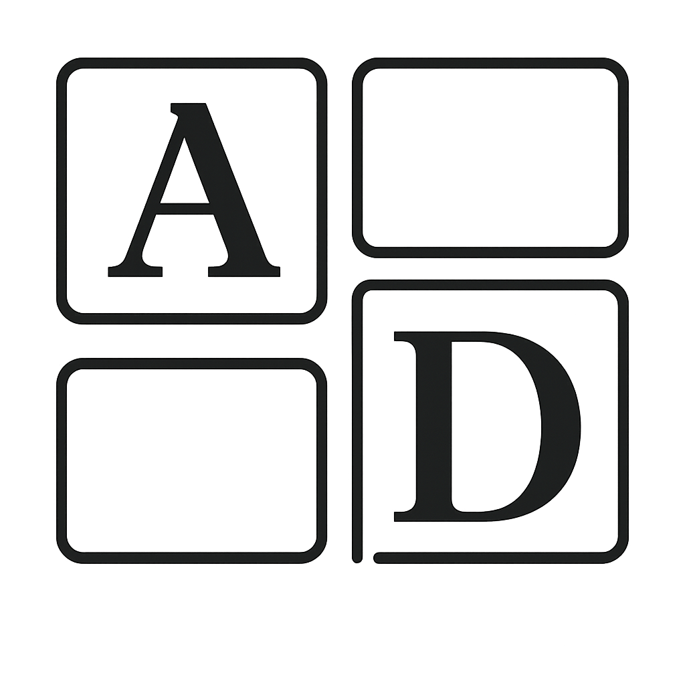

<a href="https://laravel.com" target="_blank">
   

# AgileDesk - Sistema de Gestión de Proyectos Ágiles

## Descripción

AgileDesk es una plataforma web desarrollada en Laravel 11 para la gestión de proyectos utilizando metodologías ágiles. El sistema permite a los equipos organizar, planificar y dar seguimiento a sus proyectos de manera eficiente mediante tableros Kanban, sprints y gestión de historias de usuario.

## Características Principales

### **Gestión de Proyectos**
- Creación y administración de proyectos
- Asignación de miembros del equipo
- Control de acceso basado en roles (Admin/Colaborador)

### **Tableros Kanban**
- Tableros visuales para seguimiento de tareas
- Columnas personalizables (To Do, In Progress, Done, etc.)
- Arrastrar y soltar historias entre columnas

### **Gestión de Historias de Usuario**
- Creación de historias con prioridades (Alta, Media, Baja)
- Estimación de trabajo requerido
- Asignación a sprints específicos
- Estados: "Sin estado", "En progreso", "Completado"

### **Gestión de Sprints**
- Planificación de sprints
- Asignación de historias a sprints
- Seguimiento del progreso del sprint
- Product backlog

### **Administración de Usuarios**
- Sistema de registro con validación de dominio (@unah.hn)
- Panel de administración para gestión de usuarios
- Soft delete y restauración de usuarios
- Aprobación de nuevos usuarios

### **Panel de Administración**
- Vista general de usuarios, proyectos y sprints
- Estadísticas del sistema
- Historial de cambios y actividades
- Gestión de usuarios eliminados

## Tecnologías Utilizadas

- **Framework**: Laravel 11
- **Base de Datos**: MySQL
- **Frontend**: Bootstrap 5, Blade Templates
- **Iconos**: Bootstrap Icons
- **JavaScript**: Vanilla JS para interactividad
- **CSS**: Responsive design con modo oscuro/claro

## Requisitos del Sistema

- PHP 8.2 o superior
- Composer
- Node.js y NPM
- MySQL 5.7 o superior
- Apache/Nginx

## Instalación

1. Clonar el repositorio:
bash
git clone https://github.com/tu-usuario/agiledesk.git
cd agiledesk

2. Instalar dependencias:
composer install
npm install

3. Configurar el archivo de entorno:
cp .env.example .env
php artisan key:generate

4. Configurar la base de datos en .env y ejecutar migraciones:
php artisan migrate --seed

5. Iniciar el servidor de desarrollo:
php artisan serve
